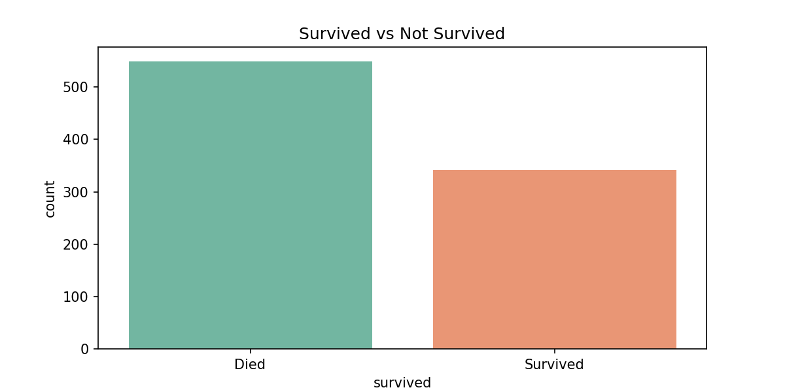
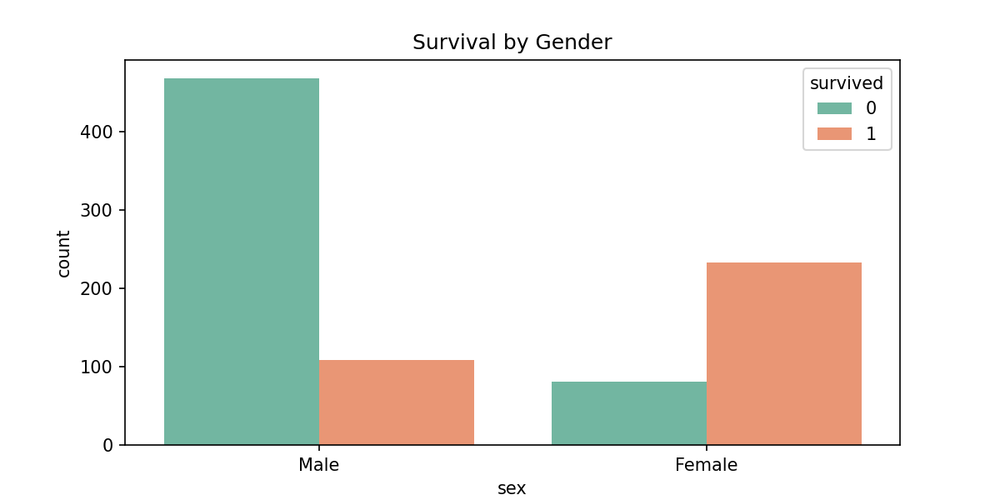

## 🚢 Titanic Survival Prediction

Logistic Regression model to predict Titanic survival.

## 📊 Results
- Accuracy: 81%
- Gender was the biggest survival factor!

## 📈 Visualizations

## 🛠️ Tools
Python | Pandas | Scikit-learn | Seaborn | Matplotlib

## ▶️ How to Run
jupyter notebook titanic_survival_prediction.ipynb
